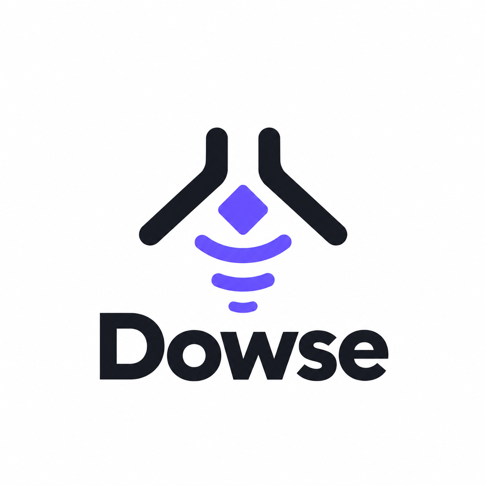

<p align="center">
  
</p>

<p align="center">
  <a href="https://github.com/<you>/dowse/releases">/dowse" alt="release"></a>
  <a href="https://pkg.go.dev/github.com/<you>/dowse">/dowse.svg" alt="Go reference"></a>
  <a href="https://github.com/<you>/dowse/blob/main/LICENSE">/dowse" alt="license"></a>
</p>

Dowse is a local semantic code search engine for [Claude Code](https://claude.com/claude-code). It is designed for finding code by what it does rather than what it is named: ask where something happens in plain English and get the exact function back. It plugs into Claude Code as an MCP server, so the agent can use it whenever grep isn't enough.

Dowse runs fully offline. Embeddings are computed on your machine with [EmbeddingGemma](https://ai.google.dev/gemma/docs/embeddinggemma), the index is a single SQLite file, and the whole tool ships as one Go binary.

Below is Dowse answering a question inside Claude Code:

<p align="center">
  
</p>

Or straight from the terminal:

```bash
dowse "where is retry backoff handled?"
```

```
pkg/client/retry.go:42      func (c *Client) backoff(attempt int) time.Duration
pkg/queue/worker.go:118     func (w *Worker) requeueWithDelay(job *Job)
internal/http/transport.go:77  func shouldRetry(resp *http.Response, err error) bool
```

> [!NOTE]
> Early days. The index format may change between minor versions; run `dowse index --force` after upgrading.

## Features

- 🔌 **Fully offline** - embeddings run on your machine through Ollama. Your code never leaves it.
- 📦 **Single binary** - no database to set up, no services to run. The index is one SQLite file.
- 🧠 **Semantic + keyword** - vector search for concepts, keyword search for names, merged into one ranking.
- 🌳 **Function-level chunks** - split with tree-sitter, so results are whole functions, not arbitrary line windows.
- ⚡ **Incremental** - only changed files are re-embedded.
- 🤖 **MCP native** - one `search_code` tool, ready for Claude Code.

## Install

```bash
go install github.com/<you>/dowse@latest
```

You also need [Ollama](https://ollama.com) with the embedding model:

```bash
ollama pull embeddinggemma
```

## Usage

Index a repo:

```bash
cd your-repo
dowse index .
```

Search from the terminal:

```bash
dowse "how do we validate webhook signatures?"
```

### With Claude Code

```bash
claude mcp add dowse -- dowse mcp
```

That's it. Claude Code now has a `search_code` tool and will reach for it when grep isn't enough.

### Keep the index fresh

```bash
dowse hook install
```

Adds a git `post-commit` hook that re-indexes changed files.

## How it works

1. **Parse** - tree-sitter splits each file into functions, methods and types.
2. **Embed** - each chunk goes through EmbeddingGemma locally.
3. **Store** - vectors and text land in `.dowse/index.db` (SQLite + [sqlite-vec](https://github.com/asg017/sqlite-vec)).
4. **Search** - your query is embedded, matched by vector and by keyword, and the two rankings are fused.

## Benchmark

Same questions, same repo, Claude Code with and without dowse. 8 concept questions ("how is a container's CPU percentage calculated?") about [zoo](https://github.com/chann44/zoo) (197 files, 1,615 chunks), each asked twice per setup. Claude Code (Opus 5.5) could only use Read, Grep and Glob, plus `search_code` in the dowse runs. Numbers are averages per question.

| | Correct | Tool calls | Input tokens | Time to answer | Cost |
| --- | --- | --- | --- | --- | --- |
| Claude Code | 16/16 | 3.44 | 128k | 13.2s | $0.158 |
| Claude Code + dowse | 16/16 | **2.06** (−40%) | 120k (−6%) | **11.8s** (−11%) | $0.174 (+10%) |

When Claude reached for `search_code` (8 of 16 runs), it needed 1.38 tool calls instead of 3.25 on the same questions. Often one call answered the question with no grep or file reads.

What this does not show yet:

- **Accuracy.** Both setups answered everything correctly. zoo is small enough for grep, and the gains reported elsewhere come mostly from 1,000+ file repos.
- **Savings in cost.** Fewer calls didn't make runs cheaper, probably because results include a lot of code. Trimming them is next.
- **Consistent use.** Claude used dowse on half the questions and grepped when the question had an obvious keyword ("AWS", "CPU").

Dowse helps most on concept questions ("where do we rate limit?"). When you already know the identifier, grep is just as good. Questions, runner and raw results are in [`bench/`](./bench).

## Configuration

Optional. Drop a `.dowse.toml` in your repo root:

```toml
model = "embeddinggemma"
dimensions = 768        # 512, 256 or 128 for a smaller index
ignore = ["vendor/", "**/*_generated.go"]
```

## Languages

Go, TypeScript, JavaScript, Python, Rust. More are easy to add - see [`lang/`](./lang).

## License

[MIT](./LICENSE) License © <you>